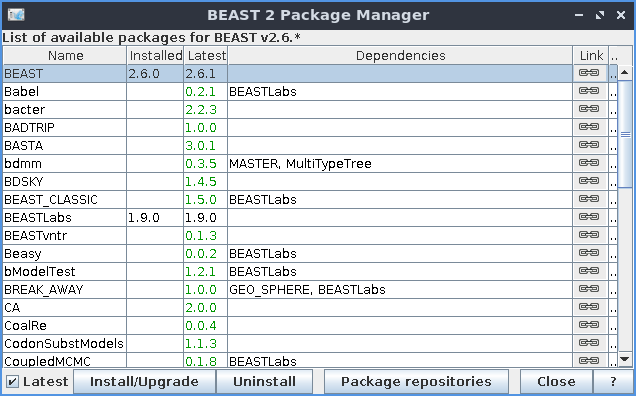

```{r setup, include = FALSE}
knitr::opts_chunk$set(
  collapse = TRUE,
  comment = "#>"
)
```

## Introduction

`mauricer` is an R package to handle BEAST2 package management from R,
similar to the BEAST2 package manager.



In this vignette, we will:

 * List all BEAST2 packages
 * Install the first non-installed BEAST2 package
 * Verify the BEAST2 package is indeed installed
 * Uninstall the BEAST2 package

To do so, we'll need to load `mauricer`. We'll also load `testthat` for testing:

```{r}
library(mauricer)
library(testthat)
```

To install BEAST2 packages, one needs

 * an internet connection
 * BEAST2 must be installed

If there is no internet connection, or if BEAST2 is not installed,
this vignette will be close to empty.

```{r}
if (!curl::has_internet()) {
  print("No internet connection")
}
if (!beastier::is_beast2_installed()) {
  print("No BEAST2 installed")
}
```

## List all BEAST2 packages

Use `get_beast2_pkg_names` to get a data frame with the name,
version and install status of all BEAST2 packages:

```{r}
if (curl::has_internet() && beastier::is_beast2_installed()) {
  beast2_packages <- get_beast2_pkg_names()
  knitr::kable(head(beast2_packages))
}
```

## Install the first non-installed BEAST2 package

Find a package that is not installed:

```{r}
if (curl::has_internet() && beastier::is_beast2_installed()) {
  package_name <- beast2_packages[
    beast2_packages$installed_version == "NA",
  ]$name[1]
  print(package_name)
}
```

Install that package:

```
if (curl::has_internet() && beastier::is_beast2_installed()) {
  mauricerinstall::install_beast2_pkg(package_name)
}
```

Note that this installation uses a non-CRAN package,
called `mauricerinstall`, as installing software
is against CRAN policy.

## Uninstall the BEAST2 package

Use `uninstall_beast2_pkg`:

```
if (curl::has_internet() && beastier::is_beast2_installed()) {
  mauricerinstall::uninstall_beast2_pkg(package_name)
}
```

Also this code uses a non-CRAN package,
called `mauricerinstall`, as installing software
is against CRAN policy.
